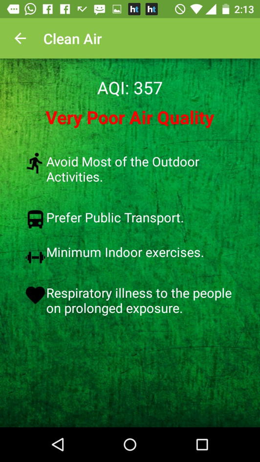
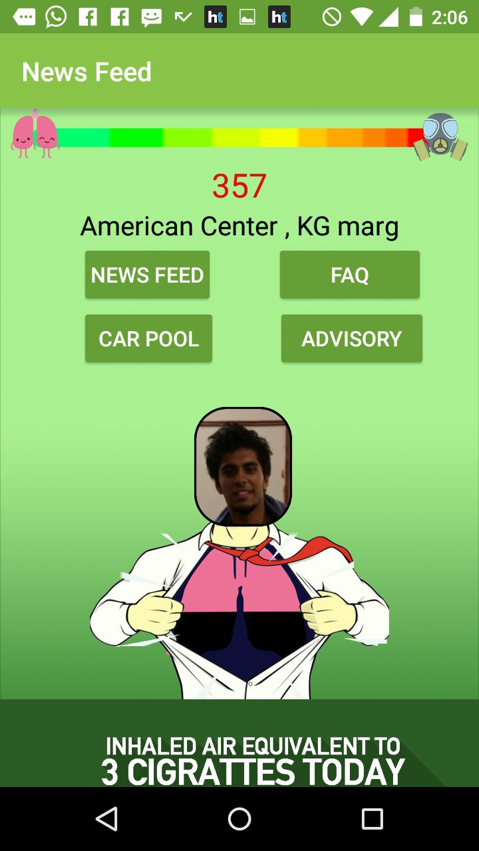
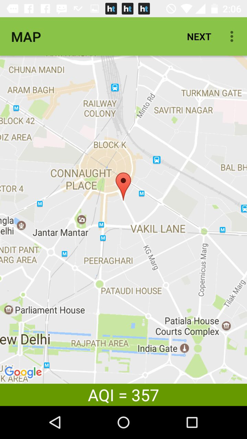
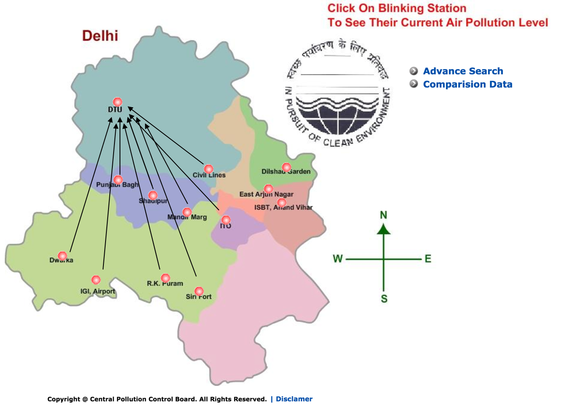

# Clean Air Asia Hackathon
Winning Prize

# Good Air
A Mobility based, air breathed tracker and corrector. Good air finds the AQI of different places even where there is no AQI reading mechanism is available, using machine learning algorithms.

|  |  |  |
| ---- | ---- | ---- |

### Problem Statement
Make an application that solves the issue of air pollution in India
How can we create an indispensable app?
How can the app make connection between the sources of air pollution and its effects.
How can we link it to health?
How can the application create accountability?

<b>WHY WOULD PEOPLE HAVE AN AQI APP WHEN OUR SMARTPHONES CAN ALREADY INFORM US ABOUT IT?</b>

### Pairwise training for Parameter optmization

Using a machine learning algorithm to predict the air quality index (AIQ) at an area where a monitoring service isn’t available.

Factors for the learning process:

1. Geolocation Factors such as: RELATIVE WIND SPEED between the known and unknown locations. RELATIVE DISTANCE between the known and unknown locations.
2. HUMAN INFLUENCED FACTORS: Industries near the, Population Density, Vehicle Consumption and Forest Cover of the known locations.

Example: Delhi has 13 locations where the monitoring stations are established.
Now we take one of the monitoring locations,      eg: DTU and calculate how the air at DTU is influenced by the other 12 locations.
We train a feature vector 𝜃 which calculates the influence of the AQIs at the 12 locations on DTU. Each of the arrow corresponds to an element in the vector: 𝜃=[𝜃-1,𝜃-2, 𝜃-3, 𝜃-4,...,𝜃-12]. We train the vector for 50-100 timestamps.

### Advisory System

Based on the AQI value of the location of the user, specific solutions are provided.
Suggestions varying from DOING YOGA to WEARING A MASK to precautions for users who suffer from asthma.
$$ The advisory can be monetized by including real-estate options, farming practices and equipment, and health clubs' promotions.
